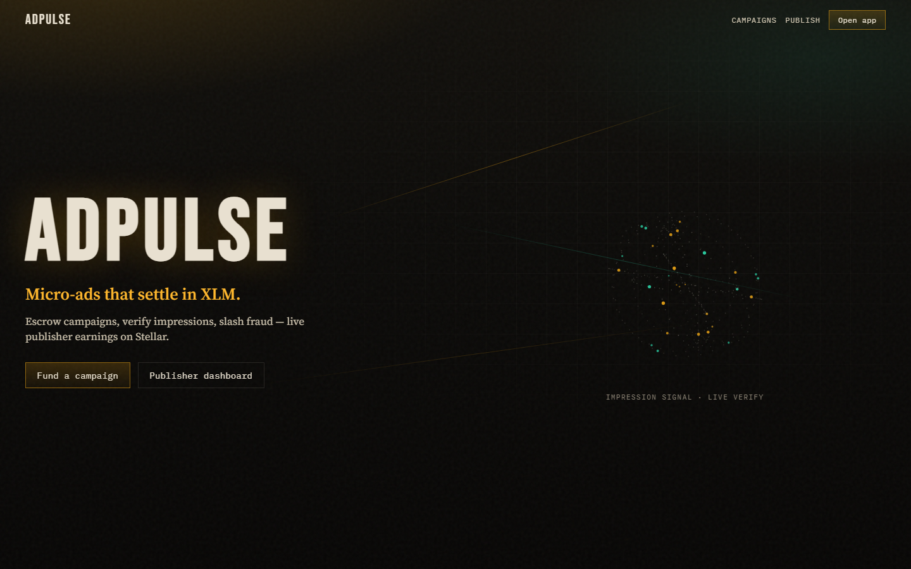
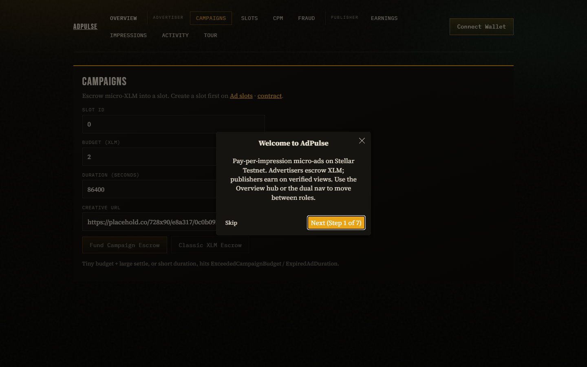
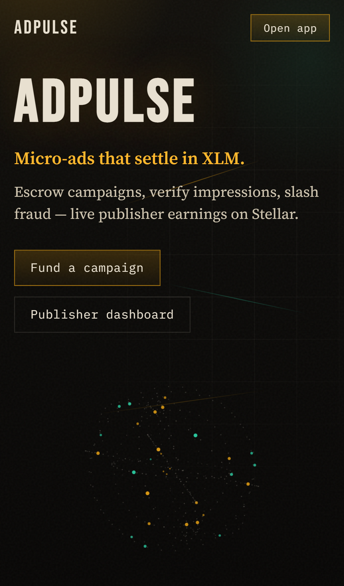

# AdPulse

**Pay-per-impression micro-ad bidding on Stellar Testnet.**

Websites publish ad slots; advertisers escrow micro-XLM budgets; verified impression batches settle to publishers. An Anti-Fraud contract can slash deposits when bot or fake views are detected.

Stellar Mastery Program submission — **Level 1 · Level 2 · Level 3**

**Author:** Nidaal \<nidaalnaazluqman@gmail.com\>

---

## Live demo

| | |
|---|---|
| **Frontend (Vercel)** | [https://adpulse-green.vercel.app](https://adpulse-green.vercel.app) |
| **Demo video** | [Watch on YouTube](https://youtu.be/rEQU_gKlc50) |
| **Network** | Stellar Testnet |

> Connect Freighter (Testnet), take the in-app **Tour**, fund a campaign, and settle verified impressions.

---

## Screenshots

<p align="center">
  
</p>

<p align="center">
  
</p>

<p align="center">
  
</p>

| Shot | Description |
|------|-------------|
| Desktop home | Brand hero + impression signal visualization |
| Desktop app | Campaign / publisher flows |
| Mobile | Responsive landing (one-column CTA + hero) |

---

## Testnet contracts

| Item | Address |
|------|---------|
| Network | Testnet |
| Admin / escrow | `GC26WJ2BPKVQQTI4KO57VNUNXQQA4GB4SPKF3NPIHHTIWC53BAWN3TYT` |
| Native XLM SAC | `CDLZFC3SYJYDZT7K67VZ75HPJVIEUVNIXF47ZG2FB2RMQQVU2HHGCYSC` |
| **Ad Space** | [`CCI2JKAC7VBL5QQLC2RXZHI5VLG3ETWCAP4VC5AXMK67J7GZY3NAFIE3`](https://stellar.expert/explorer/testnet/contract/CCI2JKAC7VBL5QQLC2RXZHI5VLG3ETWCAP4VC5AXMK67J7GZY3NAFIE3) |
| **Anti-Fraud** | [`CDJNWLDHWZAOX72ENVAE7W2MOUWZDNLTKHDGQMMGJTWTL7Q4T57PUA4H`](https://stellar.expert/explorer/testnet/contract/CDJNWLDHWZAOX72ENVAE7W2MOUWZDNLTKHDGQMMGJTWTL7Q4T57PUA4H) |

Full deployment JSON: [`deployments/testnet.json`](deployments/testnet.json)

### Sample transactions

| Step | Hash |
|------|------|
| Anti-Fraud WASM upload | [`25f57b27…d1ee55`](https://stellar.expert/explorer/testnet/tx/25f57b271762fec89095edce0a9bd3f46ab5dfb0b5acf73011d2e67fb9d1ee55) |
| Anti-Fraud deploy | [`473f5ca3…f776bc`](https://stellar.expert/explorer/testnet/tx/473f5ca3528860baf3e015d0d3843696262c91315531cb92d5b40edd8ef776bc) |
| Ad Space deploy | [`0063a4e3…930ceb`](https://stellar.expert/explorer/testnet/tx/0063a4e30ec9760c27426cea0296c26ef01e5f790905b2a172cc923409930ceb) |
| `create_slot` | [`28696dfa…f28576`](https://stellar.expert/explorer/testnet/tx/28696dfa7bd9f6f79a662cf11039fa0b7fd1a58ea4524b74ae9ab42c62f28576) |
| `fund_campaign` | [`f4ceb463…3e49de`](https://stellar.expert/explorer/testnet/tx/f4ceb463181de53d46242260ad6e417d2fb416ee36db670d3b4ac8e6833e49de) |
| `settle_impressions` (`imp_settl`) | [`9757749c…d96cc1`](https://stellar.expert/explorer/testnet/tx/9757749c17320abffd58597d7054da2976b596f81b87337528a2068323d96cc1) |

---

## Tests (7 passing)

```text
PS> cd contracts
PS> cargo test
    Finished `test` profile [unoptimized + debuginfo] target(s) in 0.42s
     Running unittests src\lib.rs (target\debug\deps\ad_space-….exe)

running 5 tests
test test::test_invalid_publisher_domain ... ok
test test::test_expired_ad_duration ... ok
test test::fund_and_settle_happy_path ... ok
test test::test_rate_limiting_payouts ... ok
test test::test_budget_depletion ... ok

test result: ok. 5 passed; 0 failed; 0 ignored; 0 measured; 0 filtered out; finished in 0.14s

     Running unittests src\lib.rs (target\debug\deps\anti_fraud-….exe)

running 2 tests
test test::register_and_verify_clean ... ok
test test::fraud_reports_trigger_slash_reject ... ok

test result: ok. 2 passed; 0 failed; 0 ignored; 0 measured; 0 filtered out; finished in 0.04s
```

---

## Quick start

```bash
# Contracts
cd contracts
cargo test
stellar contract build

# Frontend
cd ../frontend
cp .env.example .env
npm install
npm run dev
```

**Vercel:** Root Directory = `frontend`. Public Testnet IDs are in `frontend/.env.production` (no dashboard secrets).

### Docs

- [Wallet setup](docs/WALLET_SETUP.md)
- [Architecture](docs/ARCHITECTURE.md)
- [Plan / level checklist](PLAN.md)

---

## Features by level

### Level 1
- Freighter / Testnet docs
- Connect + disconnect (Wallets Kit)
- XLM balance via Horizon
- Campaign budget escrow + Stellar Expert links

### Level 2
- Multi-wallet (Freighter, xBull, LOBSTR, …)
- Ad Space on Testnet — frontend read/write
- `ImpressionBatchSettled` (`imp_settl`) event streaming
- Errors: exceeded budget, expired duration, invalid publisher domain

### Level 3
- Inter-contract Anti-Fraud `verify_batch` + slash
- Event streaming + GitHub Actions CI/CD
- Mobile-responsive publisher dashboard
- **7** Rust unit tests (budget, rate-limit, fraud, …)
- Live Vercel frontend + demo video

---

## CI/CD

[`.github/workflows/ci.yml`](.github/workflows/ci.yml) runs `cargo test`, WASM build, and frontend build.

## License

Demo project for the Stellar Mastery Program.
